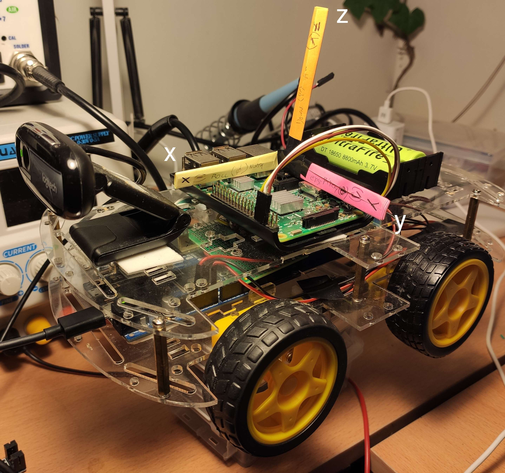

# AHRS MPU9250 library

Arduino code and jupyter notebooks for AHRS with MPU9250.

Used in [rover-firmware](https://github.com/nhorro/rover-firmware).

### Status

| Feature                                              |                    |
| ---------------------------------------------------- | ------------------ |
| Magnetometer hard-iron correction.                   | :heavy_check_mark: |
| Magnetometer soft-iron correction.                   | :white_check_mark: |
| Obtain euler angles from gyroscope integration.      | :heavy_check_mark: |
| Obtain euler angles from accelerometer+magnetometer. | :heavy_check_mark: |
| Madwick filter.                                      | :white_check_mark: |
| Kalman filter.                                       | :white_check_mark: |

### Project organization:

~~~
./
	arduino 	
		mpu9250_capture		Print CSV raw and processed measurements (can be used with Arduino Plotter).
		mpu9250_ahrs.cpp/h  AHRS MPU9250 library.
	data 					CSV captures.
	notebooks				Notebooks with AHRS algorithm development.
	doc						MPU9250 datasheet and other references.
	python					Script to save CSVs.
~~~

### Axis convention

### Implementation details

See: [Jupyter Notebook with detailed description of basic AHRS](notebooks/01%20-%20BasicAHRS.ipynb)